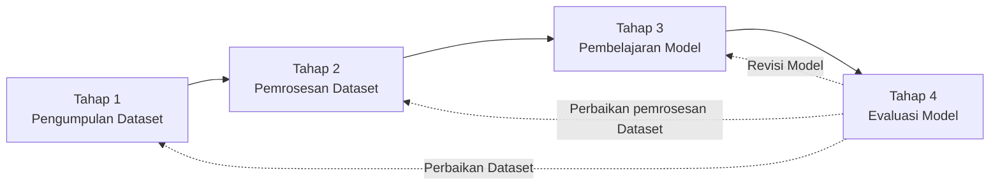
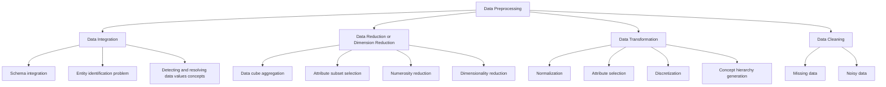

# Pertemuan 2: Pengumpulan, Pemrosesan dan Visualisasi pada Dataset

**[TKE1686] MK Machine Learning (3-SKS)**

oleh Gramandha Wega Intyanto


## 1. Alur Kerja pada Machine Learning



1. Pengumpulan Dataset: Langkah awal ML adalah mengumpulkan kumpulan data. Hal-hal yang harus dipertimbangakan dalam pengumpulan data yaitu metode pengambilan data, data akan digunakan untuk apa?

2. Preproses Data: Data yang kami kumpulkan sering kali tidak terorganisir dan tidak dapat langsung digunakan untuk melatih model. Sebelum melanjutkan ke langkah berikutnya, data perlu diproses terlebih dahulu.
    - Kumpulan data mungkin berisi data yang hilang atau berisik, perlu di **perbaiki atau di filter**;
    - Data yang berbeda dapat berada dalam rentang yang berbeda, perlu dilakukan **standarisasi atau normalisasi** karena bisa jadi menjadi masalah bagi model;
    - Perlu **menemukan dan memilih data yang lebih berkontribusi** untuk menemukan variabel target;
    - Terakhir, kumpulan data harus dibagi menjadi dua set yaitu **pelatihan** dan **pengujian** (bisa juga dilakukan pembagian menjadi 3 yaitu **pelatihan, validasi, pengujian**) | yang sering digunakan 80% set pelatihan, 20% set pengujian / 70% set pelatihan 20% set validasi 10% set pengujian.
3. Melatih Model: Berdasarkan permasalahan, jenis model yang dibutuhkan harus dipilih terlebih dahulu. Saat memilih model, informasi yang tersedia pada kumpulan data harus dipertimbangkan.
4. Evaluasi Model: Setelah model dibangun dan dilatih, penting untuk memahami seberapa baik model telah dilatih, seberapa baik kinerjanya, dan apakah model akan berguna untuk eksperimen. Kumpulan **data set pengujiandigunakan untuk menguji model** , dan berbagai **metrik evaluasi** digunakan untuk mengevaluasi dan memahami model.

## 2. Dataset
- Performa model sangat bergantung pada persiapan kumpulan data (dataset).
- Biasanya Kumpulan data paling baik disusun dalam bentuk tabel, di mana setiap baris sesuai dengan satu entri data dan setiap kolom mewakili variabel tertentu yang terkait dengan semua data yang tersedia dalam kumpulan data tersebut.
- Ukuran kumpulan data yang berkisar dari terabyte hingga megabyte dapat disebut sebagai kumpulan data besar, sedangkan kumpulan data dalam kisaran kilobyte adalah kumpulan data kecil.


## 2.1. Pengumpulan Data 

a. Data yang diambil langsung dari secara langsung dengan beberapa komponen sensor-sensor. 

    - Kamera dan sensor optik untuk pengambilan data citra.
    - Senosr IMU untuk pengambilan data percepatan, rotasi dan orientasi.
    - Bisa juga dataset kumpulan beberapa sensor seperti data loging
    - dsb.
b. Data yang diambil langsung dari beberapa platform data public

    - (roboflow, keaggle, coco, pascal voc, dsb)
        
  Beberapa Rekomendasi Dataset untuk Machine Learning dalam Teknik Elektro
  
*1. Dataset untuk Pengolahan Citra (Computer Vision)*
- **[MNIST](http://yann.lecun.com/exdb/mnist/)** Dataset angka tulisan tangan (0-9) untuk klasifikasi.  
- **[CIFAR-10 & CIFAR-100](https://www.cs.toronto.edu/~kriz/cifar.html)**  Dataset gambar untuk klasifikasi objek.  
- **[COCO (Common Objects in Context)](https://cocodataset.org/)**  Dataset objek dunia nyata untuk deteksi dan segmentasi.  
- **[Open Electrical Substation Images](https://www.kaggle.com/datasets/googleai/electrical-substation-images)**  Dataset gambar infrastruktur listrik.  

*2. Dataset untuk Pemrosesan Sinyal dan Sistem Tenaga*
- **[EEG Brainwave Dataset](https://www.kaggle.com/datasets/mihailbonchis/eeg-brainwave-dataset-feeling-emotions)**  Data sinyal EEG untuk analisis otak.  
- **[ECG Heartbeat Categorization Dataset](https://www.kaggle.com/datasets/shayanfazeli/heartbeat)**  Sinyal jantung ECG untuk klasifikasi kondisi kesehatan.  
- **[Electricity Load Forecasting](https://www.kaggle.com/datasets/robikscube/hourly-energy-consumption)**  Dataset konsumsi energi listrik untuk prediksi.  
- **[Fault Detection in Power Systems](https://www.kaggle.com/datasets/ahmedmohameddahab/power-system-fault-detection)**   Dataset deteksi gangguan pada jaringan listrik.  

*3. Dataset untuk Kendali dan Robotika*
- **[Self-Driving Car Dataset (Udacity)](https://www.kaggle.com/datasets/andrewmvd/self-driving-car-dataset)**  Dataset untuk pengendalian kendaraan otonom.  
- **[MIT Push Dataset](https://www.mit.edu/~phillipi/push/)**  Dataset untuk robotik dan manipulasi objek.  
- **[CMU Motion Capture Dataset](http://mocap.cs.cmu.edu/)**  Data pergerakan tubuh manusia untuk kontrol robot.  

*4. Dataset untuk Prediksi dan Analisis Data*
- **[Weather Dataset](https://www.kaggle.com/datasets/selfishgene/historical-hourly-weather-data)**  Dataset cuaca untuk prediksi suhu dan kondisi lingkungan.  
- **[Energy Efficiency Dataset](https://archive.ics.uci.edu/ml/datasets/Energy+efficiency)**  Dataset untuk prediksi konsumsi energi pada bangunan.  
- **[Battery Dataset](https://www.kaggle.com/datasets/arpitbhayani/tesla-battery-data)**  Data performa baterai untuk analisis degradasi.  

*5. Dataset untuk Keamanan dan Deteksi Anomali*
- **[NSL-KDD](https://www.unb.ca/cic/datasets/nsl.html)**  Dataset deteksi serangan siber dalam jaringan komputer.  
- **[Power Grid Stability Dataset](https://www.kaggle.com/datasets/berkerisen/power-grid-stability)**  Data stabilitas jaringan listrik.  
- **[Water Treatment Plant Dataset](https://archive.ics.uci.edu/ml/datasets/Water+Treatment+Plant)**  Dataset pemantauan kualitas air untuk deteksi anomali.
  


## 2.2.a Pra-Pemrosesan Data
Ini adalah tahap awal yang bertujuan untuk membersihkan dan menyusun data agar lebih siap digunakan dalam analisis atau pembelajaran mesin. Proses ini mencakup beberapa langkah utama, yaitu:
1. Data Integration (Integrasi Data) : Menggabungkan data dari berbagai sumber agar menjadi satu kesatuan yang dapat dianalisis.
2. Schema Integration: Menyamakan struktur data dari berbagai sumber.
3. Entity Identification Problem: Menyamakan identitas entitas yang sama tetapi memiliki format berbeda di beberapa sumber data.
4. Detecting and Resolving Data Values Concepts: Mengidentifikasi dan menyelesaikan perbedaan nilai data yang memiliki makna serupa.
   


## **2.2.b Pra-Pemrosesan data**

Pra-Pemrosesan data (refrensi dari buku _machine learning crash course for engineers_) juga bisa di lakukan dengan cara sederhana sebagai berikut yang akan di bahas lebih detail pada materi ini :
1. _Data Wrangling_
2. _Feature Scaling_
3. _Data Types_
4. _Data Splitting_

## a. Data Wrangling

Data wrangling, juga dikenal sebagai data munging, adalah proses pra-pemrosesan data yang mencakup pengumpulan, pembersihan, transformasi, dan penggabungan data dari berbagai sumber menjadi bentuk yang dapat diolah.

#### a.1. Explorasi Data


```python
import pandas as pd
df = pd.read_csv("data.csv")
```


```python
print(df.info())  # Menampilkan tipe data dan nilai yang hilang
print(df.describe())  # Statistik ringkasan data numerik
print(df.head())  # Melihat 5 baris pertama
```

#### a.2. Membersihkan data 

a.2.1. missing dengan imputasi


```python
X = [[1, 5],[2, 10], [np.nan, 2],[7, 35],[6, np.nan],[15, 75],[0, 0]]
print(X)
```

    [[1, 5], [2, 10], [nan, 2], [7, 35], [6, nan], [15, 75], [0, 0]]


```python
import numpy as np
from sklearn.impute import SimpleImputer

# Menggunakan imputasi mean untuk mengganti nilai NaN
imputer = SimpleImputer(strategy="mean")  # Bisa diganti dengan "median" atau "most_frequent"
X_imputed = imputer.fit_transform(X)

print(X_imputed)
```

    [[ 1.          5.        ]
     [ 2.         10.        ]
     [ 5.16666667  2.        ]
     [ 7.         35.        ]
     [ 6.         21.16666667]
     [15.         75.        ]
     [ 0.          0.        ]]


a.2.2.Menghapus duplikasi data


```python
df.drop_duplicates(inplace=True)
```

a.2.3.Mengoreksi format data


```python
df["tanggal"] = pd.to_datetime(df["tanggal"])  # Mengubah ke format datetime
df["harga"] = df["harga"].astype(float)  # Mengubah tipe data
```

#### a.3. Menggabungkan Data


```python
df_merged = pd.merge(df1, df2, on="ID")
```

### b. Feature Scaling
Saat bekerja dengan berbagai fitur atau variabel, hampir dapat dipastikan bahwa kita memiliki data pada berbagai fitur dalam rentang yang berbeda. 

> **Kasus**, satu set data memiliki dua fitur: suhu dan kelembapan. Nilai untuk suhu berkisar antara 25 hingga 0,35 ◦ C, dan nilai untuk kelembapan berkisar antara 70 hingga 90%. Rentangnya berbeda untuk kedua fitur tersebut, sehingga keduanya tidak dapat dibandingkan. Perbedaan rentang ini juga tidak sesuai untuk digunakan oleh algoritme ML.

Oleh karena itu, semacam **transformasi dilakukan pada nilai atribut sehingga semua fitur berada dalam rentang yang sebanding dan dapat digunakan**. Transformasi yang dilakukan pada data untuk tujuan ini adalah **penskalaan fitur**. Ada berbagai metode untuk penskalaan fitur, tiga di antaranya adalah **standarisasi, normalisasi, dan penambahan data _(data agumentation)_**. Metode-metode ini dijelaskan dalam bagian berikut.

#### b.1. Standardisasi
Standardisasi merupakan metode yang sangat populer untuk penskalaan fitur. Setelah menstandardisasi
himpunan data, kita memperoleh nilai rata-rata nol dan simpangan baku satuan. Metode ini
digunakan terutama dalam kasus-kasus di mana distribusi data mengikuti distribusi normal.
Menstandardisasi data tidak membawa data ke rentang tertentu yang telah ditetapkan sebelumnya.
Oleh karena itu, metode penskalaan fitur ini **tidak terpengaruh oleh outlier**. Setiap kali suatu fitur distandarisasi, setiap data terlebih dahulu dikurangi dari nilai rata-rata dan kemudian dibagi dengan simpangan baku.

$
X_{std} = \frac{X - \mu}{\sigma}
$


#### b.2. Normalisasi
Normalisasi adalah metode lain yang populer digunakan untuk penskalaan fitur. Normalisasi
adalah teknik untuk mengubah nilai numerik yang berbeda menjadi rentang umum tanpa
mendistorsi perbedaan antara nilai-nilai tersebut. Ini menskalakan semua nilai fitur
dalam rentang [0,1] atau [.−1,1]. Karena ada nilai rentang tertentu yang menormalkan
data, **outlier yang ada dalam kumpulan data memengaruhi metode ini**. Normalisasi bermanfaat ketika distribusi data kumpulan data tidak diketahui.

$X_{norm} = \frac{X - X_{min}}{X_{max} - X_{min}}$


| **Kondisi**                                      | **Gunakan Normalisasi** | **Gunakan Standarisasi** |
|--------------------------------------------------|------------------------|-------------------------|
| Data tidak berdistribusi normal                 | ✅                      | ❌                      |
| Data berdistribusi normal (Gaussian)            | ❌                      | ✅                      |
| Ada outlier ekstrem                              | ❌                      | ✅                      |
| Algoritma berbasis jarak (KNN, NN, SVM-RBF)      | ✅                      | ❌                      |
| Algoritma berbasis distribusi (Regresi, PCA, SVM-Linear) | ❌             | ✅                      |


```python
Temperature = [25, 21, 30, 35, 34, 33, 32, 33, 24, 23]
Humidity = [78, 75, 88, 72, 83, 79, 76, 88, 85, 77]

print ('Temperature =', Temperature, '\nHumidity =', Humidity)
```

    Temperature = [25, 21, 30, 35, 34, 33, 32, 33, 24, 23] 
    Humidity = [78, 75, 88, 72, 83, 79, 76, 88, 85, 77]


```python
import numpy as np
from sklearn.preprocessing import MinMaxScaler, StandardScaler

# Data asli
Temperature = np.array([25, 21, 30, 35, 34, 33, 32, 33, 24, 23]).reshape(-1, 1)
Humidity = np.array([78, 75, 88, 72, 83, 79, 76, 88, 85, 77]).reshape(-1, 1)

# Normalisasi (Min-Max Scaling)
minmax_scaler = MinMaxScaler()
Temperature_norm = minmax_scaler.fit_transform(Temperature)
Humidity_norm = minmax_scaler.fit_transform(Humidity)

# Standarisasi (Z-score Scaling)
std_scaler = StandardScaler()
Temperature_std = std_scaler.fit_transform(Temperature)
Humidity_std = std_scaler.fit_transform(Humidity)

# Menampilkan hasil
print("Hasil Normalisasi")
print("Temperature:", Temperature_norm.flatten())
print("Humidity:", Humidity_norm.flatten())

print("\nHasil Standarisasi (Z-score Scaling)")
print("Temperature:", Temperature_std.flatten())
print("Humidity:", Humidity_std.flatten())

```

    Hasil Normalisasi
    Temperature: [0.28571429 0.         0.64285714 1.         0.92857143 0.85714286
     0.78571429 0.85714286 0.21428571 0.14285714]
    Humidity: [0.375  0.1875 1.     0.     0.6875 0.4375 0.25   1.     0.8125 0.3125]
    
    Hasil Standarisasi (Z-score Scaling)
    Temperature: [-0.80977633 -1.61955266  0.20244408  1.2146645   1.01222041  0.80977633
      0.60733225  0.80977633 -1.01222041 -1.2146645 ]
    Humidity: [-0.39622642 -0.96226415  1.49056604 -1.52830189  0.54716981 -0.20754717
     -0.77358491  1.49056604  0.9245283  -0.58490566]


### c. _Data Type_

Algoritme pembelajaran mesin menangani berbagai jenis data. Oleh karena itu, berbagai jenis data memerlukan pendekatan yang berbeda terhadap algoritme ML. Jenis data dapat dikategorikan sebagai (a.1.) berurutan dan tidak berurutan dan (a.2) stasioner dan tidak stasioner.

#### c.1. Berurutan dan tidak berurutan

- Tipe data sekuensial adalah tipe data yang memiliki urutan tertentu, seperti daftar, string, tupel, urutan byte, array byte, dan objek rentang. Elemen dalam tipe data tersebut dapat diakses melalui indeksnya, yang menunjukkan posisi mereka dalam urutan dan dimulai dari 0. Gambar (a)
- Tipe data non-sekuensial tidak memiliki urutan, seperti kamus (_dictoneries_) dan set. Tidak ada urutan yang dipertahankan di antara elemen dalam tipe data non-sekuensial. Gambar (b)


#### c.2. Stasioner dan non-stasioner
- Kumpulan data stasioner diketahui memiliki sifat statistik yang konstan, seperti rata-rata, varians, dll., seiring waktu. Data dalam kumpulan data tersebut mudah diramalkan karena sifatnya tidak berubah seiring waktu. 

- Kumpulan data non-stasioner yaitu kumpulan data yang sifat statistiknya berubah seiring waktu . Jenis data ini tidak dapat diramalkan atau dimodelkan karena sifatnya yang bervariasi. Data non-stasioner memiliki tren, siklus, atau musiman di dalamnya. Gambar 3.5 menunjukkan contoh data stasioner dan non-stasioner.


### d. Data Spliting
Pemisahan data berfungsi untuk melatih model ML dengan tepat. Pemisahan yang tepat mencegah model dari overfitting, memastikan penilaian yang tepat, dan meningkatkan kinerja model. 

Cara pemisahan data yang paling umum adalah 
    
    - dengan membagi dataset menjadi dua subset—satu dataset pelatihan dan satu lagi dataset pengujian. 
    
    - namun, konvensi pemisahan menjadi tiga subset juga sudah umum. Dalam kasus ini, dataset dibagi menjadi dataset pelatihan, validasi, dan pengujian. 


## 3. Tugas Mahasiswa

Silahkan lakukan pra-pemrosesan Data pada dataset Anda yang sudah dicari, jika belum ada gunakan dataset yang sudah disediakan!

